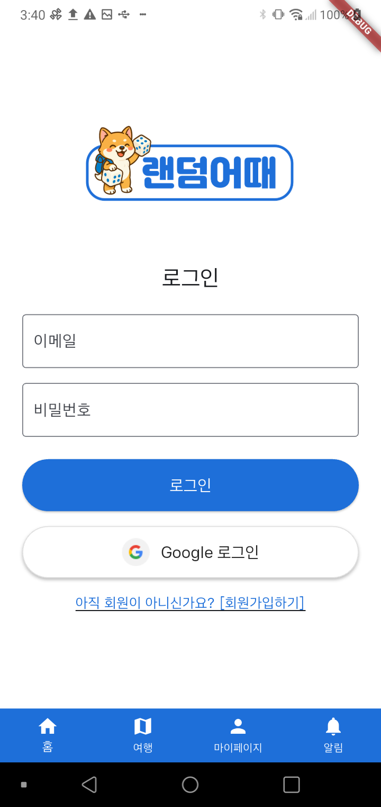
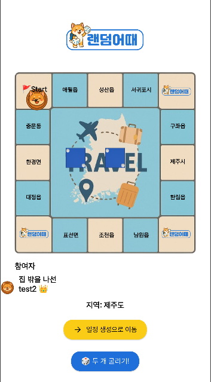
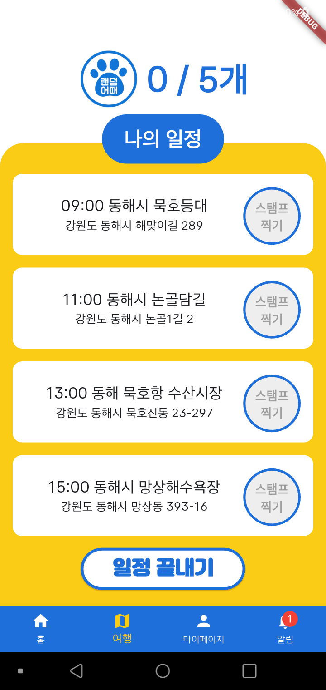
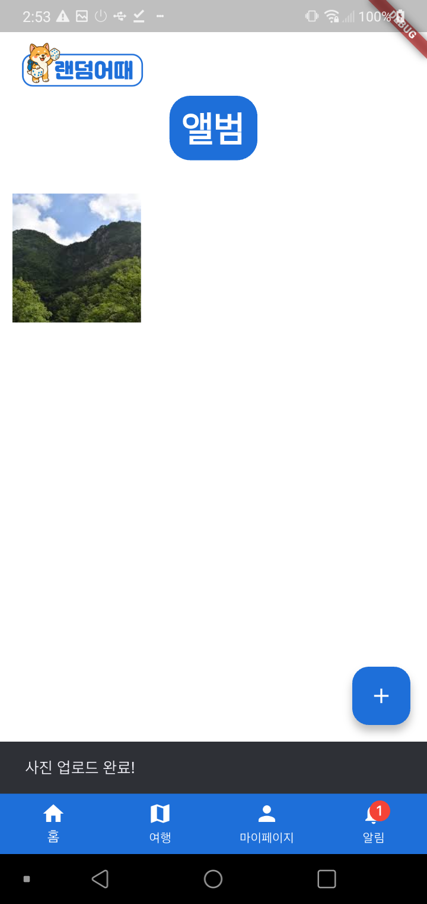
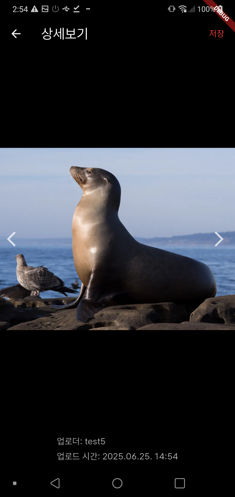
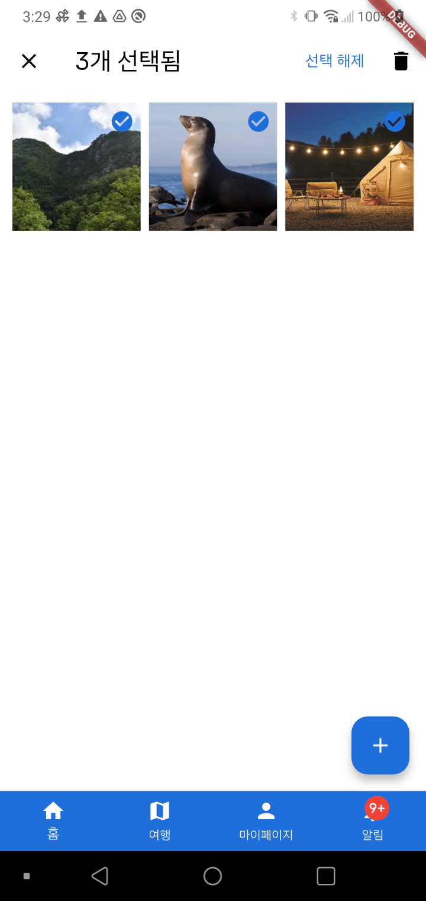
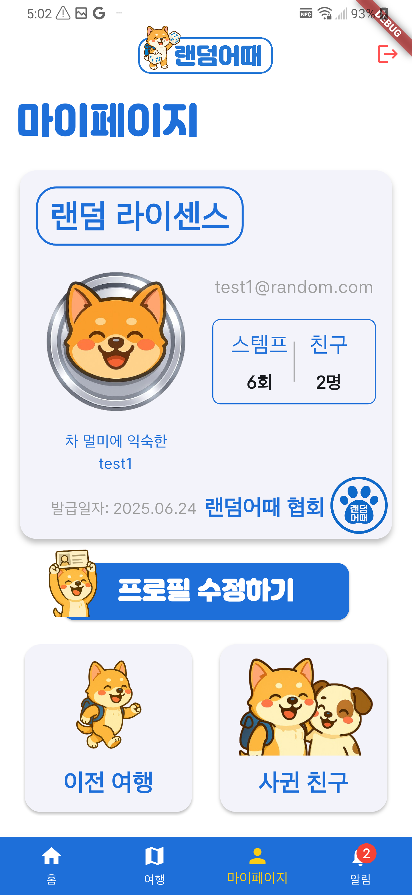
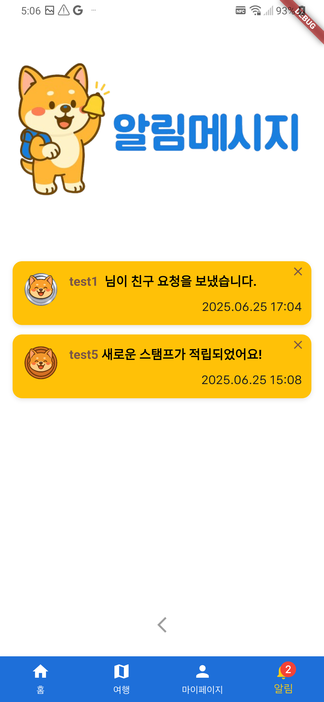

# 🎲 랜덤어때  
> **"어디든 좋아! 주사위가 정해주는 랜덤 여행"**

  

> ****

## 👨‍👩‍👧‍👦 팀 소개

| 이름 | 역할 | GitHub |
|------|------|--------|
| 윤수빈 | 팀장, AI 일정 생성 | 추가 |
| 김성규 | 마이페이지, 알림기능 | [glodstone1](https://github.com/glodstone1) |
| 박새별 | 스탬프 및 앨범 기능, 메인화면 | [SaeByeol5285](https://github.com/SaeByeol5285) |
| 유승호 | 로그인/회원가입, 축제 API 연동 | 추가 |
| 홍영은 | 주사위 로직, 게임 애니메이션 처리 | 추가 |

---

## 📅 개발 기간

**2025.06.09 ~ 2025.06.26 (17일)**

---

## 🧭 서비스 개요

**랜덤어때**는 여행지를 직접 선택하지 않아도 주사위를 굴려 랜덤한 지역을 추천받고, AI가 즉석에서 일정을 생성해주는 **여행 가챠 앱**입니다. 즉흥성과 재미를 결합하여 새로운 여행 경험을 제공합니다.

---

## 🎯 기획 배경

### 사용자 니즈와 해결방안

| 사용자의 고민 | 랜덤어때의 해결 방식 |
|---------------|-----------------------|
| 어디 갈지 정하는 게 어렵다 | 주사위를 통해 지역 랜덤 추천 |
| 일정을 짜기 번거롭다 | AI가 자동으로 일정 생성 |
| 여행 정보를 찾기 귀찮다 | 추천된 지역 내 명소/맛집/축제를 자동 제공 |
| 갑자기 훌쩍 떠나고 싶다 | 즉시 생성되는 랜덤 루트 제공 |
| 여행이 지루하게 느껴진다 | 스탬프 적립, 캐릭터, 주사위 등 재미 요소 추가 |

---

## 🧑‍🤝‍🧑 타깃 사용자

- 여행 기획이 부담스러운 사람
- 친구들과 특별한 여행을 기록하고 싶은 사람
- 게임적 재미를 여행에 접목하고 싶은 사람

---

## 🛠 주요 기능

### 1. 🎲 랜덤 여행지 선정
- 선택한 대지역 내 소지역들을 주사위에 배치
- 주사위 애니메이션 → 결과값에 따라 지역 확정
- 말판 UI로 이동 경로 시각화

### 2. 🧠 AI 기반 일정 생성
- Gemini API를 통해 명소/맛집/축제 기반 일정 자동 생성
- 사용자가 일정 항목 직접 수정 가능 (추가/삭제/순서 변경)

### 3. 🧑‍🤝‍🧑 여행방 & 친구 초대
- 여행방 생성 후 친구 초대
- 같은 방에서 주사위 굴리기 화면 공유

### 4. 🧾 스탬프 적립 & 칭호
- GPS 기반 방문 체크 → 스탬프 적립
- 누적 수치에 따라 등급 상승 및 프로필 뱃지 자동 적용

### 5. 🖼 공유 앨범
- 여행방 멤버 간 사진 업로드 / 다운로드
- 일정별 정렬, 확대보기, 선택삭제 기능 제공

### 6. 🎉 지역 축제 정보 연계
- 공공 데이터 기반 지역 축제 API 연동
- 일정에 축제 포함 → 날짜 및 테마별 추천

---

## 🧪 기술 스택

| 카테고리 | 기술 |
|----------|------|
| 프론트엔드 | Flutter (iOS / Android) |
| 백엔드/DB | Firebase (Auth, Firestore, Storage) |
| 외부 API | - Tour API 4.0 (한국 관광정보) - Google Place Map API (위도/경도 보정) - Gemini API (일정 생성) |
| 위치 기반 | Geolocator (현재 위치, 거리 계산 등) |

---

## 🖼 페이지별 구현 이미지

> 각 항목에 이미지 경로와 설명을 삽입해주세요. 아래는 템플릿입니다.

### 📄 페이지별 구현

🔐 로그인 / 회원가입 (담당: 승호)

사용자는 이메일/비밀번호로 로그인하거나 Firebase Auth 기반으로 회원가입할 수 있습니다.

🔘 메인 페이지 (담당: 새별)

앱 진입 시 보여지는 메인 랜딩 화면으로, 지역 선택 및 여행 시작이 가능합니다.

🎲 주사위 여행 (담당: 영은)

지역을 선택하고 주사위를 굴려 여행지를 랜덤 추천받는 화면입니다.

🧾 일정 생성 (담당: 수빈)

AI(Gemini)를 통해 생성된 여행 일정을 확인하고 커스터마이징할 수 있습니다.

🎉 축제 페이지 (담당: 승호)

여행 지역에 해당하는 축제를 날짜별, 테마별로 확인할 수 있습니다. 공공 API 기반으로 실시간 정보 제공.

📍 스탬프 적립 (담당: 새별)

- 스탬프 적립 기능으로 일정 완료 여부를 확인하고 시각적으로 표시합니다.

- 전체 일정 중 완료 현황을 수치로 보여주고, 여행 종료 처리를 할 수 있습니다.

🖼 공유 앨범 (담당: 새별)

  
  
  

  📸 여행 사진을 업로드하고 방 멤버들과 공유할 수 있습니다.  
  👁️ 사진을 클릭하면 확대해서 볼 수 있으며, 좌우 스와이프 및 저장 기능을 제공합니다.  
  🗑️ 사진을 길게 누르면 선택/전체 삭제 기능이 활성화됩니다.  

👤 마이페이지 (담당: 성규)

사용자는 자신이 참여한 여행방, 적립한 스탬프, 업로드한 사진 등을 마이페이지에서 확인할 수 있습니다.

🔔 알림 페이지 (담당: 성규)

여행 초대, 스탬프 적립, 친구 요청 등 주요 활동 내역을 실시간으로 확인할 수 있는 알림 페이지입니다.

---

## 📽 발표 및 시연 영상

- 🎞️ [발표 PPT 보기](https://example.com/presentation)  
- ▶️ [시연 영상 보기](https://example.com/demo-video)

---

## 👤 테스트 계정 안내

| 항목 | 정보 |
|------|------|
| 이메일 | test1@random.com |
| 비밀번호 | test1234 |
